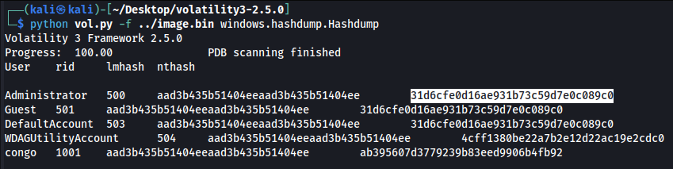

# Bad Memory
## A user came to us and said they forgot their password. Can you recover it? The flag is the MD5 hash of the recovered password wrapped in the proper flag format. 

A file is included with this challenge

---

After downloading and extracting the file, we have "image.bin".

Looking at a bunch of data inside the file, I recognize a Windows OS and finally admit it's a memory dump.

[Volatility](https://github.com/volatilityfoundation/volatility) is a tool used to extract useful datas from these memory dump.

> Dependancies : `pip install -U pycryptodome`

After installing it, I used a plugin to get the Windows account hashes.

Credentials are `congo:goldfish#` ! Converting it to md5 gives us the flag.