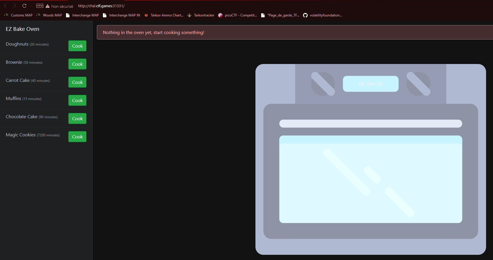
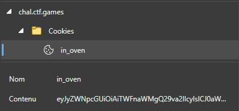

# Baking
## Do you know how to make cookies? How about HTTP flavored?

A website is accessible with this challenge

---

Browsing to the website I'm greeted with... An oven.

If I put a cookie in the oven I need to wait 7200 minutes. Looking at the cookie itself I see a base64 encoded string.

Decoding the String gives me `{"recipe": "Magic Cookies", "time": "01/01/2023, 12:11:55"}`

If I change the date to a past date and reconverting it to Base64, then modify the cookie content. I can get the flag :)

