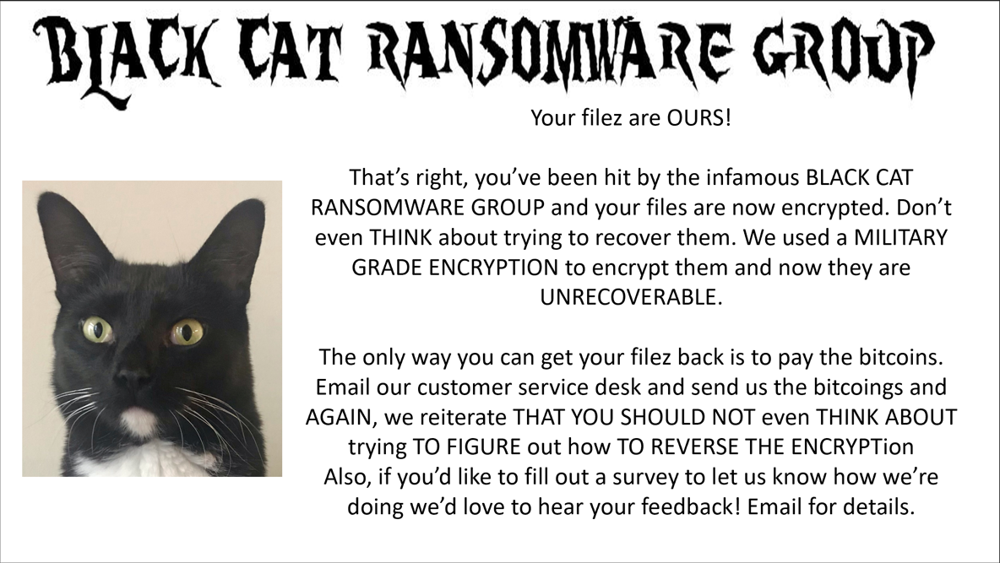
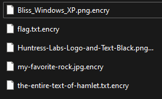
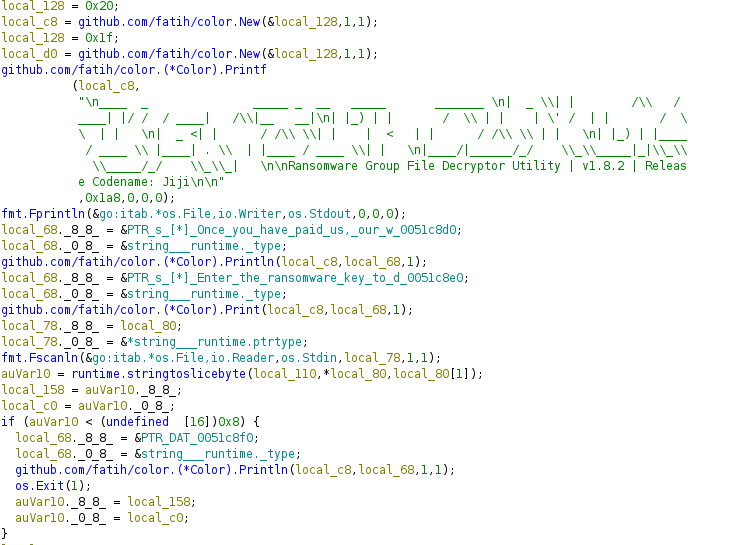
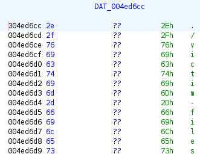

# BlackCat
## We've been hit by the infamous BlackCat Ransomware Group! We need you to help restore the encrypted files. Please help! My favorite rock got encrypted and I'm a wreck right now!

An archive is joined with the challenge.

---


When I unzip this archive, I see a bunch of encrypted files inside a directory (`victim-files`), a exe file `DecryptMyFiles.exe` that asks for a key to decrypt the files and a very cute note!




In this note we see that we should not think about reverse the encryption blabla...

Here's the victim files directory:



Obviously if I open a file I cannot read it properly.

There are 2 ways of solving this challenge.


# Easy Way: cracking the encryption

Looking at the victim files, let's focus on `the-entire-text-of-hamlet.txt.encry`. 

I can search for the exact same plain text version on google. Knowing the plain text version and the encrypted version I can perform a **known plaintext attack**.

Using [this website](https://wiremask.eu/tools/xor-cracker/), I immediatly got the key which is `cosmoboi`.

Feeding the key to the program I got the flag.

# Hard Way: reverse engineering of the exe

> Disclaimer: This is not my writeup but I'll keep it as an exemple for further rev eng CTF :) Thank you *DavidP* 

Using GHIDRA:

binary is not stripped, we fine main.main easy. this is also when we can see traces of golang and start to be annoyed. with golang, since it is a "secure" language there is  typically a lot of codegen going on that does some validations/checks. we basically need to try to ignore those
so if we go top to bottom: we can see the banner is printed. then input is read. ghidra is not good in resolving structures, but golang uses some memory layout for the objects. pretty easy in this case:


--> `local_78` is a pointer (ptrtype) and points to `local_80` that is the buffer we read to etc...
  `local_78._88 = local_80;
  local_78._08 = &string___runtime.ptrtype;
  fmt.Fscanln(&go:itab.os.File,io.Reader,os.Stdin,local_78,1,1);`




what i typically do is to check out the functionality roughly and run the exe (if sure it's save or in a vm of not) to see the behaviour and find potential strings to pinpoint code regions. in this case we are prompted to enter the key so the input stored to local_80 is the key. we remember this. also we see the length check (if ... < 0x8) so we know our key is 8 bytes

when going further down I try to orientate with system calls or calls that are resolved by ghidra. so stripping away all the secure codegen the sequence is:
```
path/filepath.Walk(&DAT_004ed6cc,0xe,local_40);
os.OpenFile(local_b8,local_150,0,0);
os.OpenFile(local_d8,local_160,0x242,0x1b6);
os.(File).Read(local_e0,local_90,8,8);
os.(File).Write(local_e8,local_90,uVar5,8);
```
this is easy enough to understand (but we can check strings in data section to see whats actually going on). but all in all, we go file by file reading from the file and writing to a (new) target file. that matches with what the decryptor is doing. reading encrypted data, and writing decrypted data to some output
here for instance: the decryptor searches files in ./victim-files folder





so now we have to find out how data is transformed. starting with the read: `os.(File).Read(local_e0,local_90,8,8);`
this reads to `local_90` (normally i rename things on my way for readability) eg encrypted_input_buffer.  the next 30 or so lines are all sanity checks golang does (read ok, etc.. and outputting a huuuge error message). 

then:
```
          for (iVar3 = 0; iVar3 < 8; iVar3 = iVar3 + 1) {
            if (local_158 == 0) {
                    / WARNING: Subroutine does not return /
              runtime.panicdivide();
            }
            uVar8 = iVar3 % (int)local_158;
            if (local_158 <= uVar8) {
                    / WARNING: Subroutine does not return */
              runtime.panicIndex(uVar8);
            }
            (byte)(encrypted_input_buffer + iVar3) =
                 (byte)(iVar3 + encrypted_input_buffer) ^ (byte)(uVar8 + local_c0);
          }
          if (8 < uVar5) {
                    /* WARNING: Subroutine does not return /
            runtime.panicSliceAcap(uVar5,encrypted_input_buffer,uVar5);
          }
```

this is our data transformation. we can see our encrypted buffer bytes are rewritten:`(byte )(encrypted_input_buffer + iVar3) =(byte )(iVar3 + encrypted_input_buffer) ^(byte )(uVar8 + local_c0);`

and finally written to file: `os.(File).Write(local_e8,encrypted_input_buffer,uVar5,8);`


so this is the interesting bit. we see the bytes are xored with (`uVar8 + local_c0`). uVar8 is calculated inside the loop: `uVar8 = iVar3 % local_158`. where `iVar3` is the loop counter. so we have two variables in this. `local_158` and `local_c0`. we need to check where they are initialized and with what
right after reading the keyword from stdin they are assigned
  `auVar10 = runtime.stringtoslicebyte(local_110,*local_80,local_80[1]);
  local_158 = auVar10._88;
  local_c0 = auVar10._08;`

again, struct is not resolved by ghidra. but it's basically a member access. we do convert the input string to an byte array (slice) and assign `local_158` with the LENGTH of the byte array (we know this is 8) and `local_c0` pointing to the bytearray.

so returning to our loop:

`uVar8 = iVar8 % 8` // modulo 8 is constant.. our key is length 8
`local_c0` is a pointer, so we look up by `uVar8`. now we can rewrite this to be more readable:

```
for (int i = 0; i < input_length; ++i) {
  encrypted_buffer[i] ^= key[i%8]
}
```
thats basically a vanilla xor encryption with fixed size key. the rest is easy enough. we need to reconstruct the key. for this we need 8 known bytes. we have them with the PNG header. we do xor([8 png header bytes], [8 encrypted png header bytes]) get the key. slam it into the decryptor and have our files