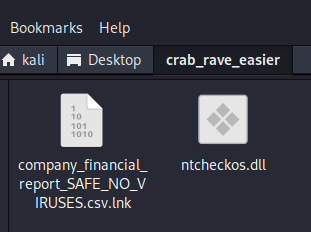
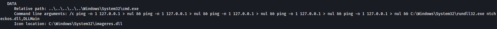
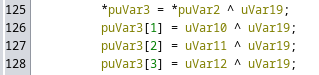
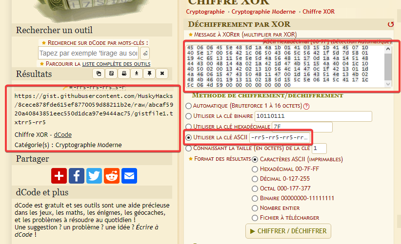
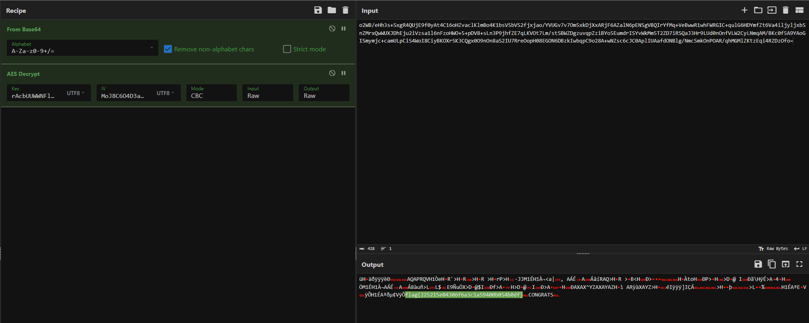

# Crab Rave
## My biologist friend told me that everything eventually evolves into a crab-like form. I don't know if that's true but I guess malware authors got a head start on that evolution. To save you some time, I went ahead and found you the 10 hour extended version of Crab Rave on YouTube (https://www.youtube.com/watch?v=-50NdPawLVY). You'll need it.

## So, here's the deal. This one is tough, so we're giving you a "Choose Your Own Adventure" challenge. Are you super confident with reverse engineering? Try crab_rave_harder.7z. Not so confident with RE? We gave you crab_rave_easier.7z.

Two files are included with this challenge

---

> Since I'm newbie with reverse engineering I put this as a disclaimer, I'm doing my best writing this but there could be errors, not in the methodology but in the explanations... That's why I also chose the "easy" one which is... Not so easy uh.


# File analysis

After decompiling, I found 2 files. 



My guess is that the first one is a trigger for the second one. 

Using `LnkParser3` I retrieve the data from the lnk file :

```
──(kali㉿kali)-[~/.local/bin]
└─$ ./lnkparse /home/kali/Desktop/crab_rave_easier/company_financial_report_SAFE_NO_VIRUSES.csv.lnk
```

The output is quite big so I just put the interesting info:



My guess was correct : It just run the dll with starting point DLLMain.


# DLL Decompilation

Using GHIDRA, I feed him the dll and find a huge collection of functions etc... I go to DLLMain.

## DLLMain

```
undefined8 DLLMain(void)

{
                    /* 0xb4f0  1  DLLMain */
  NtCheckOSArchitecture();
  return 0;
}
```

Leads me to `NtCheckOSArchitecture();`

## NtCheckOSArchitecture();

The function is huge (>600 lines). I suspect a lot of obfuscation and useless lines here so I just read it quickly to find interesting things. I found `InjectFlag()` at line 572 which is very sus to me.

## InjectFlag();

`InjectFlag()` is also very huge (400 lines). Looking at it I see some blocks that are interesting :

### Line 130
```c   
litcrypt_internal::decrypt_bytes
            (&local_308,&DAT_103cd840,0x89,
             (byte *)"-rr5-rr5-rr5-rr5-rr5-rr5-rr5-rr5-rr5-rr5-rr5-rr5-rr5-rr5-rr5-rr5-r",0x42);
             reqwest::blocking::get(&local_228,URL,local_2f8); 
```
Looking at the function `decrypt_bytes` I see some special lines here



Googling a bit I find out it's a XOR function with `-rr5-rr5-rr5-rr5-rr5-rr5-rr5-rr5-rr5-rr5-rr5-rr5-rr5-rr5-rr5-rr5-r` as key.

The data to be XOR'ed by this function are stored inside `&DAT_103cd840`. Looking at it I can get the hex datas and extract them.

`45 06 06 45 5e 48 5d 1a 4a 1b 01 41 03 15 1b 41 45 07 10 40 5e 17 00 56 42 1c 06 50 43 06 5c 56 42 1f 5d 7d 58 01 19 4c 65 13 11 5e 5e 5d 4a 56 48 11 17 0d 1a 4a 14 51 48 44 43 00 48 14 4a 02 1a 42 1d 47 4b 51 15 4a 40 04 1c 10 40 50 02 00 13 42 02 13 10 56 4c 14 47 0c 1f 42 13 01 1d 4a 46 06 15 47 43 50 48 11 47 00 1d 16 43 51 4e 13 4b 02 48 4b 46 01 19 13 11 02 18 5d 15 5c 5e 06 14 5c 41 17 1c 5c 06 4d 59 00 00 00 00 00 00 00`

If we remove the null bytes I manage to decipher this and get a web link!




https://gist.githubusercontent.com/HuskyHacks/8cece878fde615ef8770059d88211b2e/raw/abcaf5920a40843851eec550d1dca97e9444ac75/gistfile1.txt

At this point I can confirm I'm on the right path because it leads to the challenge creator's github.

I cannot use the content from the link but it'll be useful in a few minutes. (note: It is base64 encoded)

`o2WB/eHh3s+SxgR4QUjE9f0yAt4C16oHZvaclKlmBo4K1bsVSbVS2fjxjao/YVUGv7v7Om5xkDjXxARjF6AZalN6pENSgVBQIrYfMq+VeBwwR1whFWRGIC+qulG6HDYmfZt6Va4iljyljxbSnZMrxQwWUXJDhEju2iVzsa1l6nFzoHWO+5+pDV8+sLn3P9jhfZE7qLKVOt7Lm/stSBWZDgzuvqpZziBYo5EumdrISYvWkMm5T2ZD7iRSQaJ3Hr9LUd0nOnfVLW2CyLNmqAM/BKc0f5A9YAoGISmymjc+camULpCiS4WoI8CiyBKOXr5K3CQgx0O9nOn8aS2IU7RreOopH08EGON6DBzkIwbqpC9o28A+wNZsc6cJC0AplIUAafdONBlg/NmcSmkOnPOAR/qhMGMlZKtzEqi4RZDzOfo=`


### Line 185

```c
libaes::Cipher::new_256
                  (&local_228,
                   "rAcbUUWWNFlqMbruiYOIsAyVQHS78orvMoJ8C6O4D3asAApBBase64 decoding error: ");
        libaes::Cipher::cbc_decrypt
                  (&local_3d8,&local_228,"MoJ8C6O4D3asAApBBase64 decoding error: ",0x10,
                   pppppppuVar10,pppppppuVar9);
```

Looking at the 2 functions here I get these informations :

- ``Base64 decoding error`` is misleading 
- libaes is just AES encryption
- Second function tells me it is AES-CBC exactly


For AES-CBC decryption we need a key and a vector. It seems like the 2 Strings here are what I need.

Putting all these into CyberChef I managed to get the flag :)



