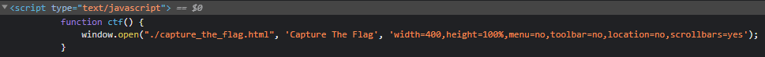
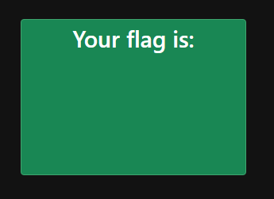
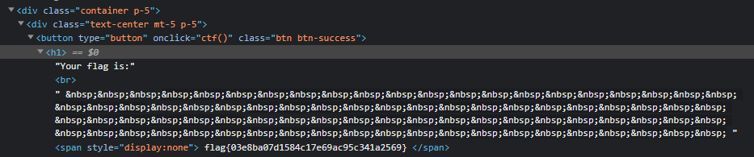

# F12
## Remember when Missouri got into hacking!?! You gotta be fast to catch this flag!

A website is accessible for this challenge

---

The website is just a big button "Capture the Flag" that pop us a new window and immediatly close it. "Gotta go fast"...

F12 is also the default key to inspect web pages. Looking at the big button I check the script linked to it and see that another page is called. 

Browsing to this page, I see this (confirming I'm all good)

Again, inspecting the element gives us the flag.

