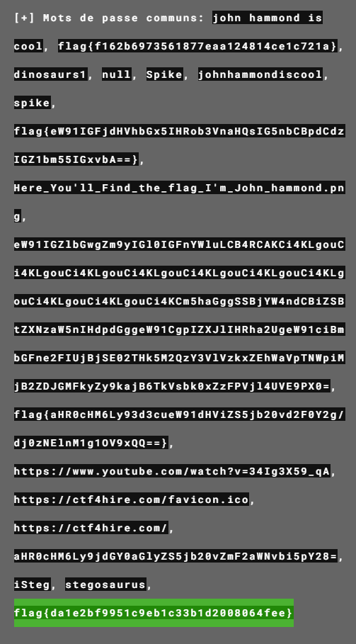
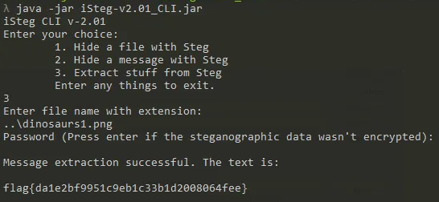

# Land before Time
## This trick is nothing new, you know what to do: iSteg. Look for the tail that's older than time, this Spike, you shouldn't climb.

A file is included with this challenge.

---

Looking at the challenge context, the tool I've to use is iSteg.

Before going with iSteg I put the image in [Aperi Solve](https://www.aperisolve.com) and got the flag immediatly, I guess this wasn't the intended way...

Intended way is using iSteg to extract "stuff" from the file.

