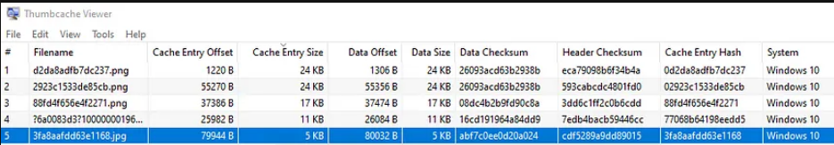

# Opposable Thumbs
## We uncovered a database. Perhaps the flag is right between your fingertips!

A file is included with the challenge

---

After downloading the file, I get `thumbcache_256.db`

Googling a bit, I [found this tool](https://thumbcacheviewer.github.io/) to see the datas.

After feeding the db file into the tool, the flag is hidden in the last row.

