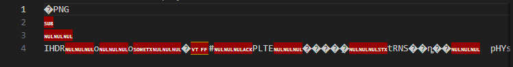

# Query code

## What's this?

A file is attached to the challenge.

---

First download the file

There's no extension... I have to discover what am I looking at.

As I did on notepad and string-cheese, I renamed the file to .txt and the first line indicates that this is a PNG file.

This is pretty straightforward! Just add extension .png to the file and it'll show a QR Code. This code leads to the flag!

