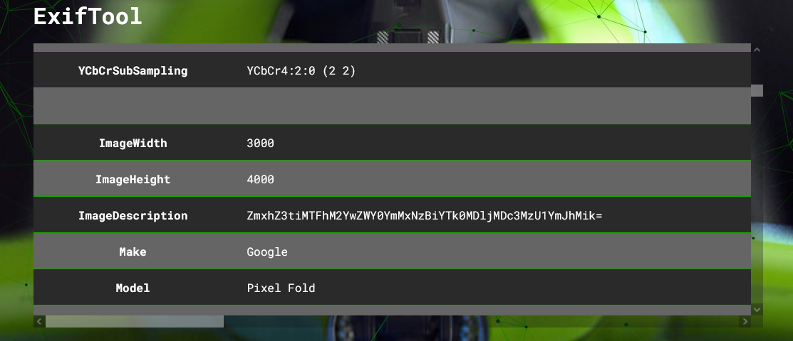

# Where Am I
## Your friend thought using a JPG was a great way to remember how to login to their private server. Can you find the flag? 

A file is included with this challenge

---

Let's download the file.

It's a basic jpg image. Let's feed it to Aperi'Solve to see what's hidden inside.

Looks like exif tools has found something.

ImageDescription field is a base64 String.

`echo ZmxhZ3tiMTFhM2YwZWY0YmMxNzBiYTk0MDljMDc3MzU1YmJhMik= | base64 -d` 

Gives us the flag as the output!