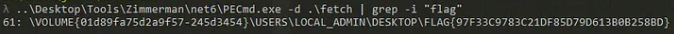

# Wimble
## "Gretchen, stop trying to make fetch happen! It's not going to happen!" - Regina George, Mean Girls

A file is included with the challenge

---

Let's download the file.

Using my favourite fool `file` I know this is a `Windows imaging (WIM) image v1.13, XPRESS compressed, reparse point fixup`

Googling a bit I found [this awesome repo](https://ericzimmerman.github.io/#!index.md) and used PECmd combined with grep to find the flag.

