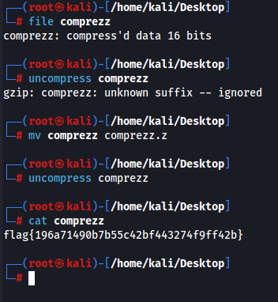

# Comprezz
## Someone stole my S's and replaced them with Z's! Have you ever seen this kind of file before?

A file is included containing a string

---

Let's download the file.

We see that comprezz archive is... Obviously, a compressed file but I cannot extract directly. Using uncompress I see that a suffix is missing...

The challenge context gives us a hint that S were replaced by Z, I thought of Linux compressed file. (A Z file is compressed UNIX file used to archive files and save space.) 

I also know that files compressed with compress often have the extension .z

Maybe let's rename the file with `.z` suffix ?

