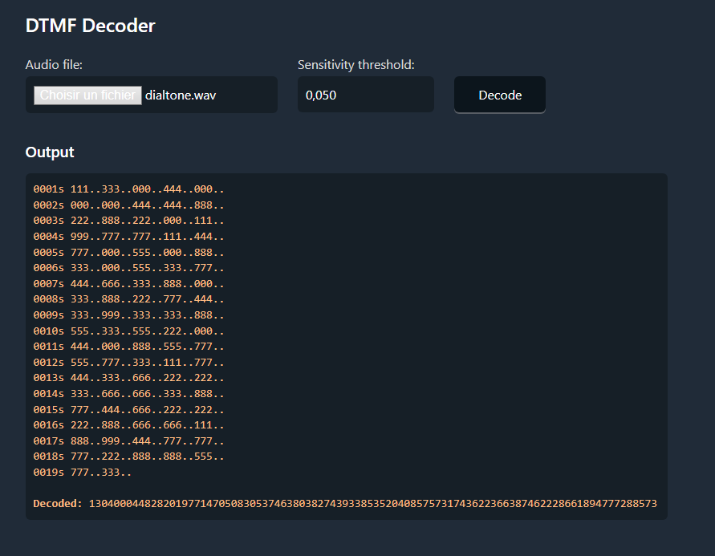
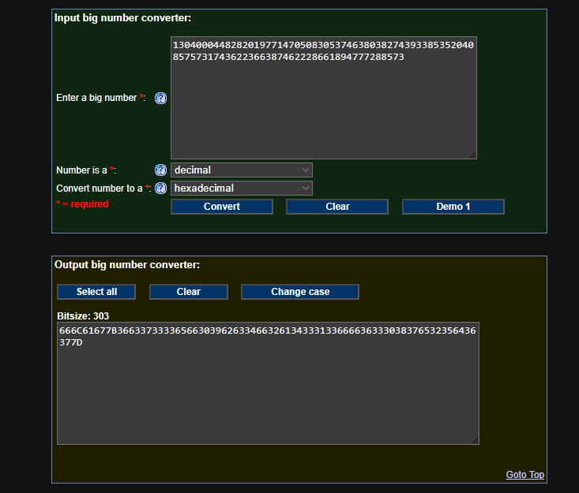
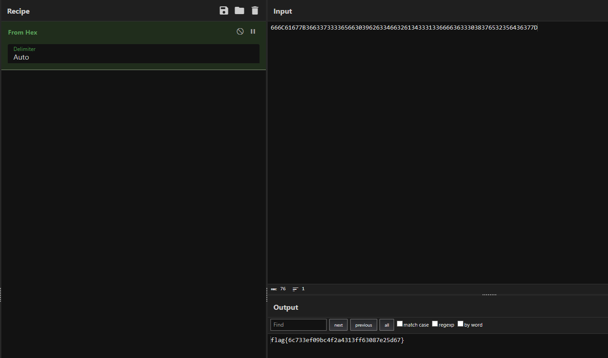

# Dialtone
## Well would you listen to those notes, that must be some long phone number or something!

A file is included with the challenge

---

Let's download the file.

It's a .wav file (sound file). Listening to it we have a long serie of notes from these old phones back in the day.

After googling a bit I learned that these are DTMF tones. There are a ton of decoder out there so I [just chose one](https://dtmf.netlify.app/) and fed him the file.

Output is `13040004482820197714705083053746380382743933853520408575731743622366387462228661894777288573`

If you convert it to hexadecimal you obtain `666C61677B36633733336566303962633466326134333133666636333038376532356436377D`

After that, another convert from Hex and here's the flag!

