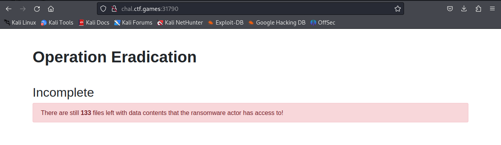
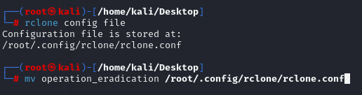
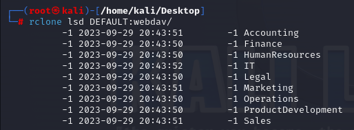
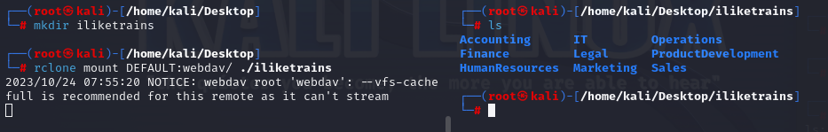

# Operation Eradication
## Oh no! A ransomware operator encrypted an environment, and exfiltrated data that they will soon use for blackmail and extortion if they don't receive payment! They stole our data! 

## Luckily, we found what looks like a configuration file, that seems to have credentials to the actor's storage server... but it doesn't seem to work. Can you get onto their server and delete all the data they stole!?

A file and a website are included in this challenge


---


Looking at the website we have a page that indicates the amount of files we have to delete. I guess if lower this number to 0 we'll discover the flag.



# File analysis

```
type = webdav
url = http://localhost/webdav
vendor = other
user = VAHycYhK2aw9TNFGSpMf1b_2ZNnZuANcI8-26awGLYkwRzJwP_buNsZ1eQwRkmjQmVzxMe5r
pass = HOUg3Z2KV2xlQpUfj6CYLLqCspvexpRXU9v8EGBFHq543ySEoZE9YSdH7t8je5rWfBIIMS-5
```

We have credentials and a URL. That is a good start. At first I thought these were encoded or encrypted but seems not.

# Connecting to webdav

Browsing directly to http://$website$/webdav prompts me for a authentication but I cannot pass through with the given credentials.

Googling a bit gave me the info that this is a configuration file for [rclone tool](https://rclone.org/).

After installing the tool, modifying URL and put the config file in rclone configuration I managed to connect.

(I dit it as root which is... Not recommended, but I don't care since it's a throwable VM.)



After that, I could connect and authenticate to the directory.




Browsing into the whole directory I found other directories and files. Everything is encrypted as said by the challenge context.

Unfortunately it seems that I don't have rights to delete but I can create files via rclone.

Mounting the remote directory to my machine helped me a lot.




I tried tooling for hidden files but something caught my eyes in the permissions. I have write permission... Which means I can overwrite every file in this tree with nothing thus eradicate any stolen data.

`find ./ -type f -exec sh -c '> {}' \;`

After running this command at the root directory, I got the flag on the website!

