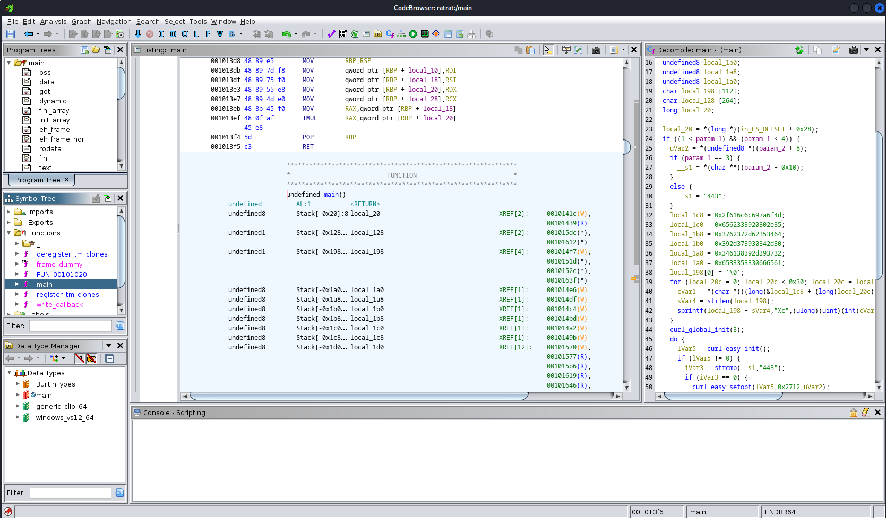
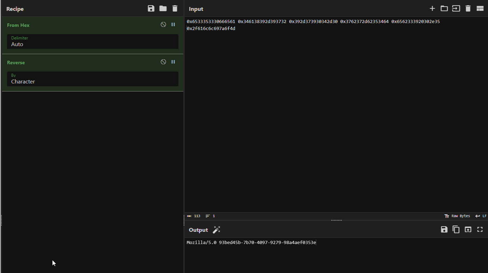

# Speakfriend
## It seems like this website was compromised. We found this file that seems to be related... can you make any sense of these and uncover a flag?

A file is included and a website is accessible

---

Let's start with the file, the website is useless for now.

It's a binary file so we have to reverse engineer it to see what's going on there.

# Reverse engineering

After feeding the file to GHIDRA and looking at the main function, one thing that I caught is the hex values here on the right.

Another important information is that the program uses cURL to send (*guessing*) some kind of request to the website.

Taking these values and feeding him to CyberChef, I find something interesting. I also found that the output is reversed.

CyberChef detects a User-Agent! 

Let's use this User-Agent to send a request to the website using this command (I used cURL flags to accept self-signed certificates and to follow redirections).

`curl -i -k -A "Mozilla/5.0 93bed45b-7b70-4097-9279-98a4aef0353e" https://chal.ctf.games:31099/ -L`

As I expected, the flag is in the response

