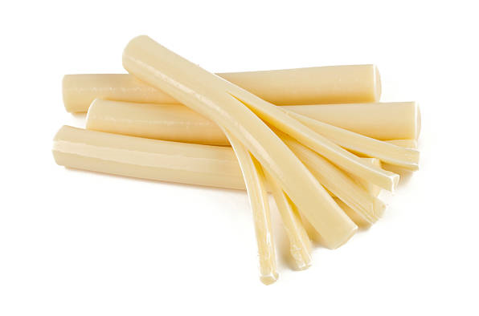
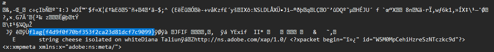

# String cheese

## Oh, a cheese stick! This was my favorite snack as a kid. My mom always called it by a different name though...

A file is attached to the challenge.

---

First download the file, it's a basic jpg file that shows us... Well... Cheese.

> My mom always called it by a different name though...

It's an hint that we should rename the file to another format. Let's try a basic txt?

When I open the file there's a lot to see but if you do a basic text research (CTRL+F) for "flag" you can spot it in the file.

